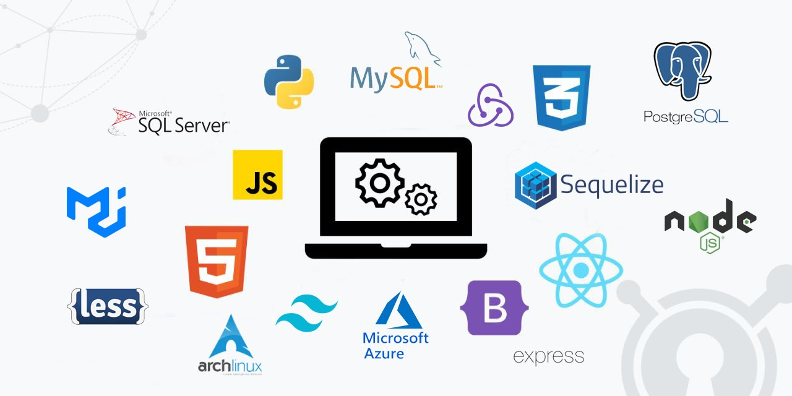

<!-- # Ricardo Suarez    -->
# <div align="center"> I'm Ricardo, full-stack developer 👨‍💻 🚀</div>  

[](https://github.com/ricardosuab93)
[](https://www.linkedin.com/in/ricardosuab93/)
[](https://twitter.com/richiesuarez)
[](https://www.instagram.com/ricardosuab93/)
[](https://www.youtube.com/channel/UCZl42HGcJUVtQq_slMvGonw)


<!-- ## Full Stack Developer -->

  

- 🔭 I’m currently working on my portfolio.
- 🌱 I’m currently living in Peru but I really love to travel abroad.
- ❓ Since 2006 I've been working on tech.

```javascript
const Richard = {
   pronouns: "he" | "him",
   askMeAbout: ["web dev", "tech", "music", "Linux", "Video Games", "Movies"],
   code: ["Javascript", "HTML", "CSS", "Python", "Java", "C++", "SQL"],
   OS: ["Windows", "ArchLinux", "Ubuntu"],
   technologies: {
      frontEnd: {
         js: ["React", "Redux"],
         css: ["Material UI", "Bootstrap", "Tailwind CSS", "Less"]
      },
      backEnd: {
         js: ["Node", "Express"],
         misc: ["Bash", "Firebase", "Azure", "Google Cloud"]
      },
      databases: ["mySQL", "SQLServer", "PostgreSQL", "Sequelize", "MongoDB"],
    },
   architecture: ["OnPremise", "Serverless", "SPA"],
   funFact:["Looking for a 10% body fat"]
};
```
## Currently and continuos learning
<p align="center" >
<a href="https://www.linux.org/" target="_blank"></a>  
<a href="https://www.mongodb.com/" target="_blank"></a>
<a href="https://www.typescriptlang.org/" target="_blank"></a>  
<a href="https://www.docker.com/" target="_blank"></a>
<a href="https://www.python.org/" target="_blank"></a>  
<a href="https://www.djangoproject.com/" target="_blank"></a>  
<a href="https://flask.palletsprojects.com/" target="_blank"></a>  
<a href="https://flutter.dev/" target="_blank"></a>  
<a href="https://firebase.google.com/" target="_blank"></a>  
</p>


### About me

<!--START_SECTION:waka-->

```text
From: 18 January 2023 - To: 21 May 2023

Total Time: 172 hrs 3 mins

JavaScript   66 hrs 57 mins  ⣿⣿⣿⣿⣿⣿⣿⣿⣿⣶⣀⣀⣀⣀⣀⣀⣀⣀⣀⣀⣀⣀⣀⣀⣀   38.92 %
SQL          63 hrs 37 mins  ⣿⣿⣿⣿⣿⣿⣿⣿⣿⣄⣀⣀⣀⣀⣀⣀⣀⣀⣀⣀⣀⣀⣀⣀⣀   36.98 %
TypeScript   11 hrs 31 mins  ⣿⣶⣀⣀⣀⣀⣀⣀⣀⣀⣀⣀⣀⣀⣀⣀⣀⣀⣀⣀⣀⣀⣀⣀⣀   06.70 %
CSS          10 hrs 12 mins  ⣿⣦⣀⣀⣀⣀⣀⣀⣀⣀⣀⣀⣀⣀⣀⣀⣀⣀⣀⣀⣀⣀⣀⣀⣀   05.94 %
JSON         5 hrs 15 mins   ⣷⣀⣀⣀⣀⣀⣀⣀⣀⣀⣀⣀⣀⣀⣀⣀⣀⣀⣀⣀⣀⣀⣀⣀⣀   03.06 %
HTML         4 hrs 38 mins   ⣶⣀⣀⣀⣀⣀⣀⣀⣀⣀⣀⣀⣀⣀⣀⣀⣀⣀⣀⣀⣀⣀⣀⣀⣀   02.70 %
Python       4 hrs 36 mins   ⣶⣀⣀⣀⣀⣀⣀⣀⣀⣀⣀⣀⣀⣀⣀⣀⣀⣀⣀⣀⣀⣀⣀⣀⣀   02.68 %
Markdown     3 hrs 8 mins    ⣦⣀⣀⣀⣀⣀⣀⣀⣀⣀⣀⣀⣀⣀⣀⣀⣀⣀⣀⣀⣀⣀⣀⣀⣀   01.82 %
TSConfig     37 mins         ⣄⣀⣀⣀⣀⣀⣀⣀⣀⣀⣀⣀⣀⣀⣀⣀⣀⣀⣀⣀⣀⣀⣀⣀⣀   00.37 %
Bash         37 mins         ⣄⣀⣀⣀⣀⣀⣀⣀⣀⣀⣀⣀⣀⣀⣀⣀⣀⣀⣀⣀⣀⣀⣀⣀⣀   00.36 %
```

<!--END_SECTION:waka-->


<!---
gu35t2018/gu35t2018 is a ✨ special ✨ repository because its `README.md` (this file) appears on your GitHub profile.
You can click the Preview link to take a look at your changes.
--->
